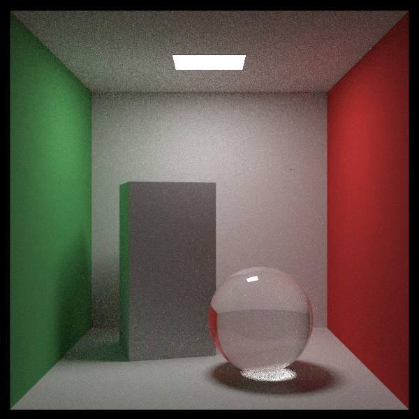

# Ilya

A basic raytracer based on the [Raytracing in a weekend](https://raytracing.github.io/) series
and [Physically Based Rendering](https://www.pbr-book.org/) book.

Features:
- Lambertian diffusion
- Specular reflections
- Transparent materials
- Emissive materials
- Isotropic media
- Color/image textures
- Perlin noise textures
- BVH nodes
- Instancing
- Importance sampling
- Next-neighbour resampling
- Defocus blur
